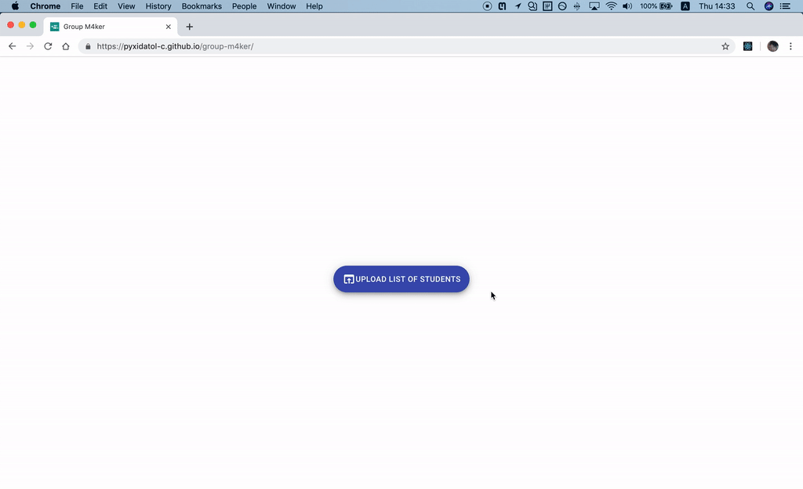
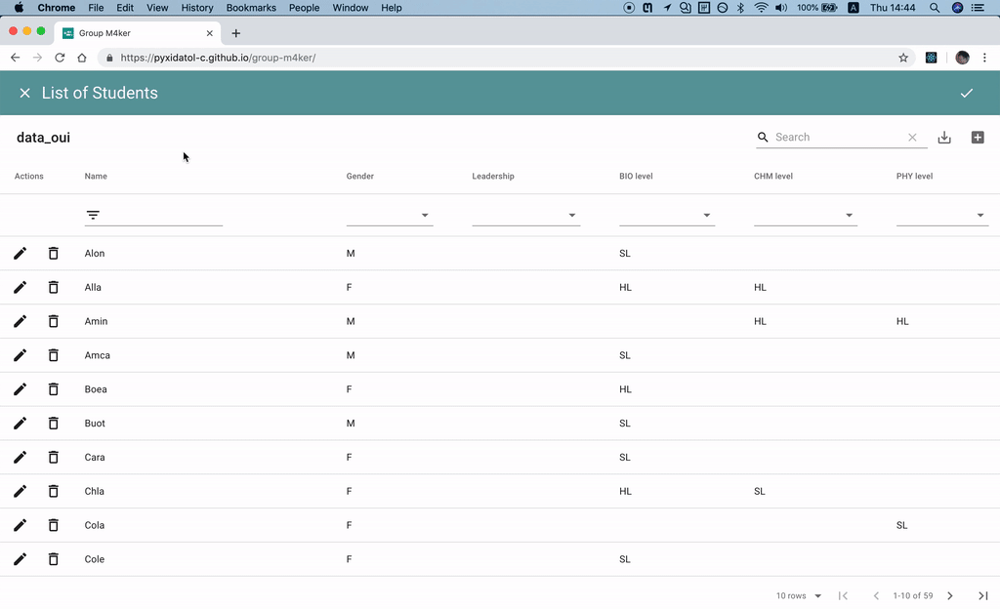
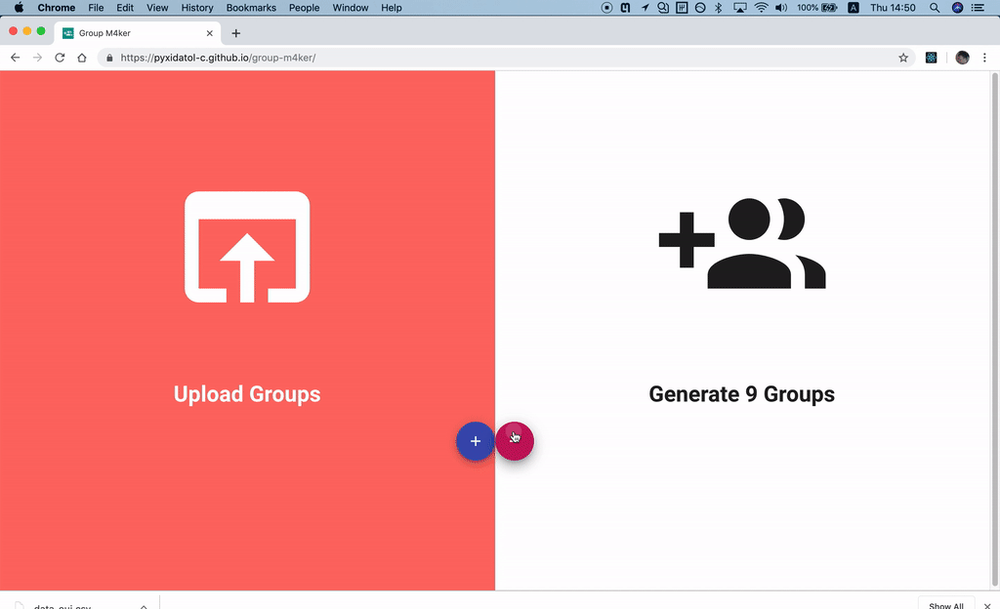
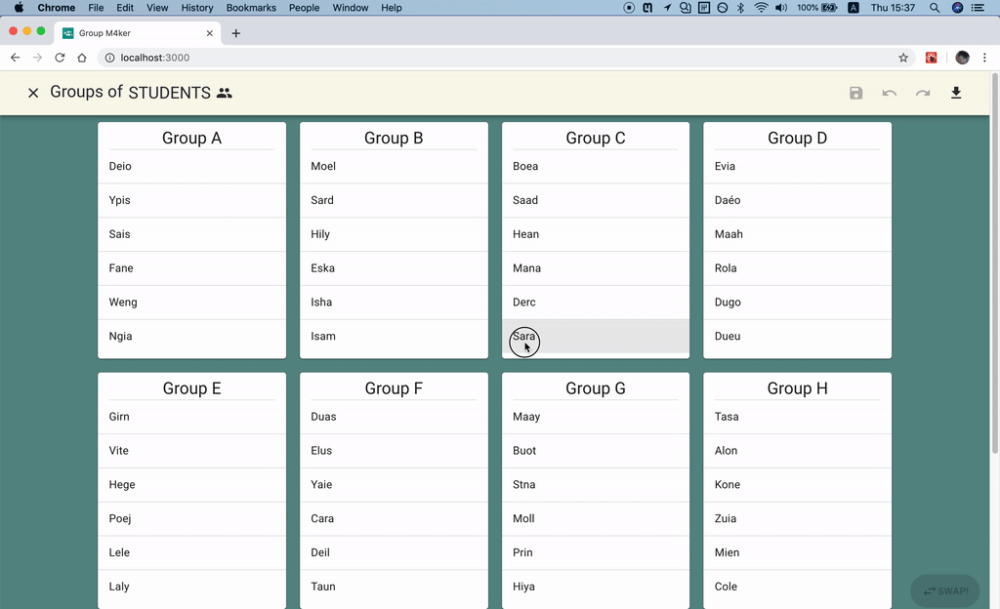
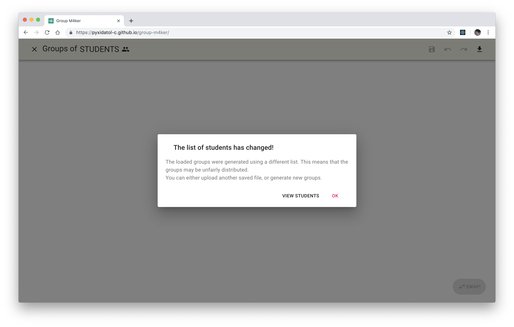

<div align="center">
    
</div>

# Group M4ker
A webapp that generates fair groups for field trips (IB Group 4 Project).

## Getting started
### Use online
https://pyxidatol-c.github.io/group-m4ker/

### Use offline
(instructions for MacOS)

1. Download the latest build from https://github.com/Pyxidatol-C/group-m4ker/releases
2. Unzip the downloaded file to an easily findable location. We will use `~/Desktop`.
3. Open up terminal. Type in the following lines:
```shell
cd Desktop/build/  # you can tab for auto-complete
python -m SimpleHTTPServer  # or `python3 -m http.server`
```
4. Open http://0.0.0.0:8000/ in your browser - done!

## Usage
### 1. Students
Firstly, you need to have a spreadsheet of the students' information, like:

| Student        | Gender | Leadership | Bio | Chm | Phy |
| -------------- | ------ | ---------- | --- | --- | --- |
| Jingjie Yang   | M      |            |     | HL  | HL  |
| Lilia Evgeniou | F      | Yes        | HL  | HL  |     |


If you just want to try the app out, a mock data file is available: [`examples/data_oui.csv`](examples/data_oui.csv)

Refer to [here](#Columns) for specifications on the header name and cell values of the columns.

### 2. Upload students.csv


### 3. Edit the list of students


* You can upload a different list of students by clicking on the cross at the top-left corner.
* You can edit, delete, or add a row using the corresponding buttons.
* It is possible to filter by a value or search for a name using the corresponding fields.
* Once you have finished editing, remember to save the csv using **Export as CSV** near the top-right corner if you wish to keep the changes after closing the tab.
* Click on the tick at the top-right corner to proceed.

### 4. Generate / Upload groups


* Use the **+** and **-** buttons to adjust the number of groups you wish to generate.
* Click on the black icon to generate the groups. This process can be slow, but usually takes up to 5 seconds.
* Alternatively, you can upload a saved groups file by clicking on the white icon - more on this later.

### 5. Tweaking groups


* You may now view the generated groups.
* After selecting a student, all other students of the same profile (same gender, subjects, leadership) will be highlighted.
* Once two students of the same profile are selected, you can use the red "Swap!" button located at the bottom-right corner to swap them. In this way, it is usually possible to separate students who do not get along together without compromising the fairness of the groups.
* You can undo, redo, and save the swaps made - but don't forget to download the groups file by clicking on the button at the top-right corner.


### 6. Oh snap!


* This happens when the list of students used to generate the groups does not match the loaded list. The consequences include missing or mismatched information and possibly an unfair distribution of students. 
* You can re-upload/generate the groups using the loaded list of students by clicking the "OK" button;
* alternatively, you can view/edit the loaded list of students and maybe upload a different list using the "VIEW STUDENTS" button.

Other unidentified issues may occur. Please
* take a screenshot (with the console if possible) and open an issue on https://github.com/Pyxidatol-C/group-m4ker/issues
* reload the page and continue using the app, hoping that you can't reproduce the bug

## Specifications
### Columns
Below we detail the requirements for the **headers** and *cells* for each column.

Note that the **headers** are case and space insensitive - `" "`s are ignored and `"A"` is considered the same as `"a"`.

#### Name
* the **header** must include `Name` or `Student`
    * e.g. `Student`, `Name`, or `Student Name`
* the *cells* can be anything

#### Gender
* the **header** must include `Gender` or `M/F`
* the *cells* can be either `M` for male, `F` for female, or other values (default if the column is not found).

#### Leadership
* the **header** must include `Leader`
    * e.g. `Leadership`
* the *cells* can be either:
    * non-empty, e.g. `Yes` - the student is considered as a strong leader
    * empty - otherwise (default)

#### Biology
* the **header** must include `BIO`
    * e.g. `BIO level`
    * If 2 column headers both include `BIO`, the column on the left will be chosen:

         | ... | BIO Level | BIO Group | ... |
         | --- | --------- | --------- | --- |
         | ... | SL        | G4        | ... |

         Here `BIO Level` and not `BIO Group` will be identified as the column for the students' biology levels.
* the *cells* have to be one of:
    * `SL` - standard level
    * `HL` - higher level
    * anything else - not taking this subject (default)


#### Chemistry
* the **header** must include `CHM`
    * e.g. `CHM level`
* the *cells* have to be one of:
    * `SL` - standard level
    * `HL` - higher level
    * anything else - not taking this subject (default)

#### Physics
* the **header** must include `PHY`
    * e.g. `PHY level`
* the *cells* have to be one of:
    * `SL` - standard level
    * `HL` - higher level
    * anything else - not taking this subject (default)

### Export as csv
Finally, please export your spreadsheet in `csv` format so that the app will work properly.

## Techncial details
* This project was bootstrapped with [Create React App](https://github.com/facebook/create-react-app).
* The nice-looking tables and buttons n all are from [Material-UI](https://material-ui.com) and [material-table](https://material-table.com).
* The webapp is deployed on github pages using [gh-pages](https://www.npmjs.com/package/gh-pages)

## Other details
* This project has no testing whatsoever.
* The code is written in roughly 3 days by someone who has not done any front-end development since a year ago.
* The group generation algorithm is copied from https://github.com/ejm-programming-club/Group-M4ker, a no longer maintained iOS version of this app.
  * The algorithm finds and executes the swap that decreases the differences between groups by the greatest amount, until any swap would make the groups worse.
  * I do not actually know if steepest descent is more effective than random descent, or if the returned grouping is a local or global optimum - todos for ~~never~~ later.
